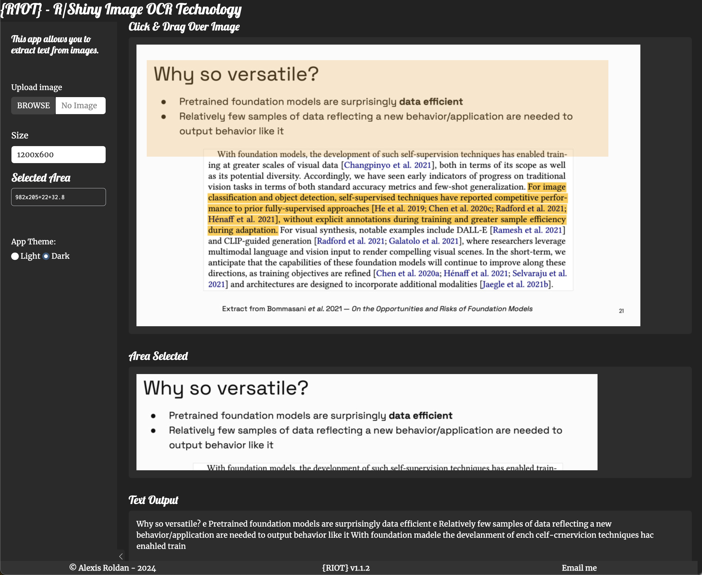
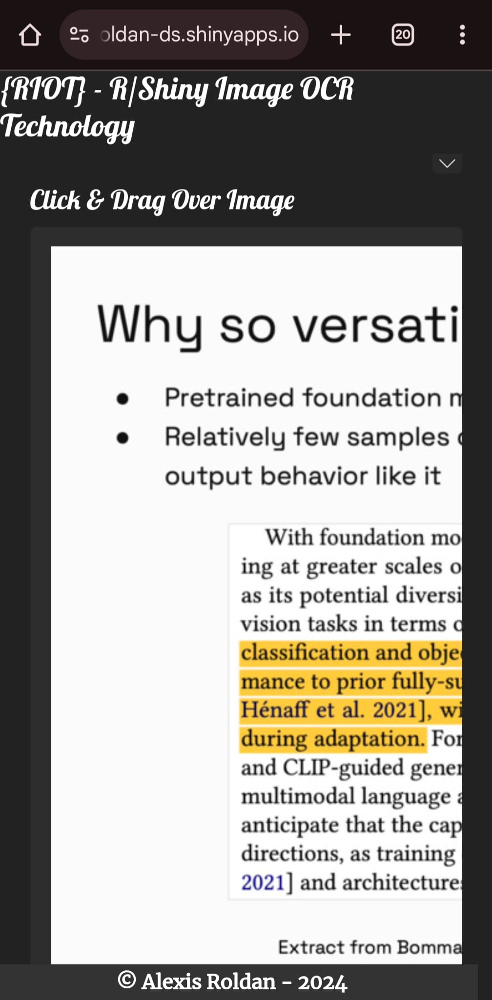

# {RIOT} - R/Shiny Image OCR Technology 🔍📄✨

[](https://www.r-project.org/)
[](https://shiny.rstudio.com/)
[](https://github.com/tesseract-ocr/tesseract)
[](https://docs.ropensci.org/magick/)

> **{RIOT}** (R/Shiny Image OCR Technology) is a powerful interactive application designed to bridge the gap between static images and actionable text data. Built with R Shiny, it leverages the Tesseract OCR engine to provide real-time text extraction from user-selected image regions. Perfect for data scientists, researchers, and anyone needing to digitize text from images efficiently.

## 🚀 Benefits & Use Cases

### For Data Scientists & Analysts
- **📊 Data Extraction**: Quickly pull numerical data or text from screenshots of tables, charts, or PDFs.
- **🤖 Dataset Creation**: Build training datasets for NLP models by extracting text from large collections of images.
- **⚡ Workflow Automation**: Prototype OCR pipelines visually before deploying them in batch processing scripts.

### For Researchers & Academics
- **📚 Archival Analysis**: Digitize text from scans of old books, manuscripts, or newspapers.
- **📝 Literature Review**: Extract quotes and references from image-based papers or slides.

### For General Productivity
- **📋 Document Digitization**: Convert photos of receipts, business cards, or whiteboards into editable text.
- **♿ Accessibility**: Assist in creating text-to-speech compatible versions of image content.

## 📸 Preview

### Web Version


### Mobile Version
<br>
<br>


## ✨ Core Features

- **🖱️ Interactive Selection**: Click and drag to select specific areas of an image for targeted OCR.
- **🔄 Real-time Processing**: Instantly view the cropped region and the extracted text as you adjust your selection.
- **🎨 Customizable Themes**: Switch between Light and Dark modes to suit your working environment.
- **🖼️ Image Manipulation**: Resize images dynamically to improve visibility or OCR accuracy.
- **📱 Responsive Design**: Works seamlessly on desktop and mobile devices.

## 👨‍💻 Developing Similar Tools for Data Science

This application serves as a blueprint for data scientists looking to build interactive image analysis tools. Here is how you can develop similar applications:

### 1. Choose Your Core Engine
Identify the R wrapper for the underlying technology you need.
- **OCR**: `tesseract`
- **Computer Vision**: `magick`, `imager`, or `opencv`
- **Deep Learning**: `keras` or `torch`

### 2. Design the Reactive UI
Use Shiny's `imageOutput` with interaction parameters:
```r
imageOutput("plot", click = "plot_click", brush = "plot_brush")
```